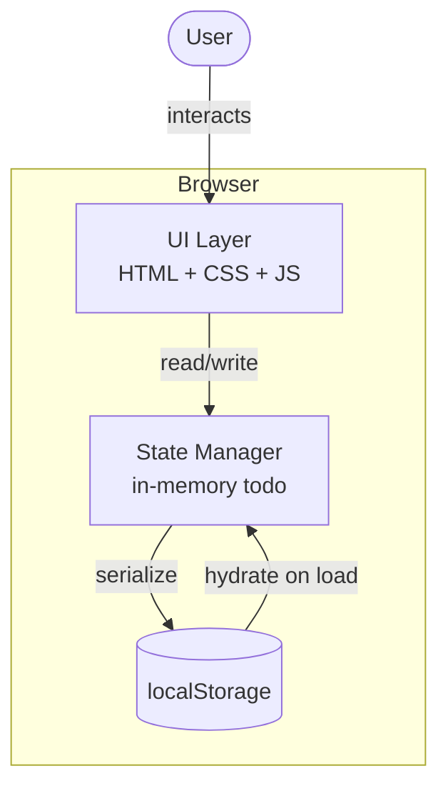

# simple-todo — System Overview

## Architecture Diagram

## Tech Stack

| Layer | Choice | Rationale |
|---|---|---|
| Language | Vanilla JavaScript (ES modules) | Zero build step; NANO scope doesn't warrant a framework |
| Markup | Single `index.html` | One page, one component — no routing needed |
| Styling | Embedded `<style>` block | Keeps deployment to a single file |
| Persistence | `localStorage` | Requirement MUST-5; no backend or database needed |
| Testing | Manual / browser console | Proportional to NANO scope |

## Key Decisions

1. **No framework** — A single-todo app needs no React/Vue overhead. Vanilla JS keeps the dependency count at zero.
2. **Single HTML file** — All markup, styles, and script live in one file for trivial deployment (open in browser or any static host).
3. **State model** — One nullable object `{ text: string, completed: boolean }` stored in `localStorage` under key `simple-todo`. `null` means empty state.
4. **Enforcement of single-todo rule (MUST-4)** — The UI hides the creation form when a todo exists; the state manager also guards against double-creation.

## Handoff

### Artifacts
- `docs/architecture/00-system-overview.md` — this file

### Environment Variables / API Keys
- None required. The app is entirely client-side with `localStorage` persistence.

### Blockers
- None.
